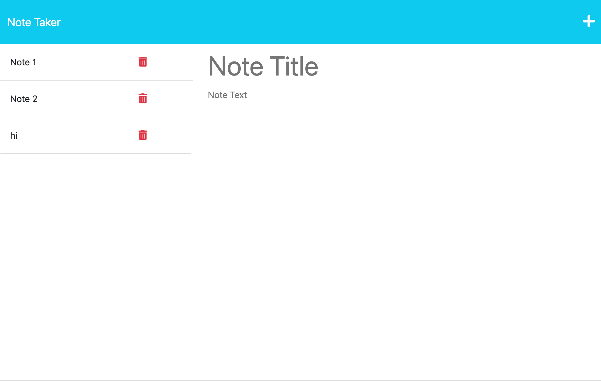

# Note-taker

The purpose this application is to help users write, read and their notes. The application utilizes express.js. When a user writes in the note taker application, their information will be stored  and can be deleteed if needed.

# React-Portfolio

## Description

The goal of this project is to create a React portfolio application where employers are able to view my portfolio of work samples with my Contact information, Resume available for download and a brief About section of myself while also making the page as user-interactive as possible.

## Table of Contents

- [Installation](#installation)
- [Usage](#usage)
- [Credits](#credits)
- [Features](#features)

## Installation

This page was accomplished with technologies such as React. In order to add features to the application, I worked on adding features in the component folder of my react. I also utilised react icons. I utilized Tailwind which is a css library as well in order to create the application.

## Usage
Usage of my web application is done when the portfolio is loaded. Afterwards, user is presented with a page containing a header, a section for content, and a footer which allows the user to view my name and navigation with titles corresponding to different sections of the portfolio. The user is also able to view the titles About, Portfolio, Contact, and Experience/Resume, and the title corresponding to the current section is highlighted
 a navigation title is clicked.

The Portfolio section contains titled images of six of my applications with links to both the deployed applications and the corresponding GitHub repositories.

The Contact section displays a contact form with fields for a name, an email address, and a message.

The Resume section enables user to access a downloadable resume.

The Footer section presents user with text or icon links to the my GitHub and LinkedIn profiles (I do not have one at the moment , however, the link provided directs user to linkedIn). I also do not have a twitter at the moment that I am able to direct user to. However, My Github profile link is attached.

Below, are screenshots of how my web application currently looks like:

## Credits

Class-activities.

## Features

Features about my project include:

- When the Note-taker app is open, it shows a notes page.
- when user clicks links on the note page existing notes are shown on the left side of the page.
- Empty fields on the right side of the page is used to enter a note title and notes text.
- Save icons which is located on the top right is used to save the notes whcih are then shown on the left sign of the page.

## Links
Code link: https://github.com/Awele1111/Note-taker

Demo link: https://awele1111.github.io/Note-taker/

Heroku link: https://boiling-wildwood-27412.herokuapp.com/

